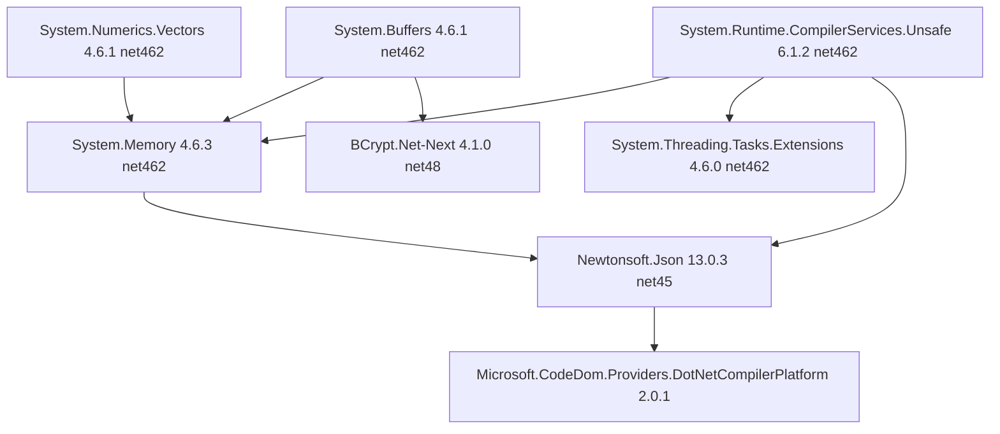

# Adapt NuGet Packages to Fresh C1 Install (dependency-order, test-as-you-go)

> **Goal:** Replicate the manual NuGet installs done on the reference site (`E:\_CODE_\WebDev\SystemC1`)
> into the `C1AfterSetup` pipeline so a **fresh** C1 install (`E:\C1\dev\Website` as `-site`) gets the
> same working AuthKit packages automatically.
>
> **Method (user's VS 2022 workflow):** treat the reference site as if it does NOT exist. Add each
> NuGet package **one at a time**, starting from the **deepest dependency** (leaf first, topologically),
> and test each addition. VS 2022 lists a package's dependencies when you install it — cancel that
> install, manually install the newest possible versions of those dependencies first (they already
> exist in the `packages/` store), then install the target package.
>
> **Last updated:** 2026-08-07

---

## 1. Current State (what the pipeline already has)

[`sources/bin`](../C1AfterSetup/sources/bin) currently ships 6 DLLs, and
[`setup.manifest.json`](../C1AfterSetup/Config/setup.manifest.json:12) `binDependencies` lists them:

| DLL | Source package (pin) | Already deployed? |
|-----|----------------------|-------------------|
| `BCrypt.Net-Next.dll` | `BCrypt.Net-Next 4.1.0` (net48) | ✅ |
| `Microsoft.CodeDom.Providers.DotNetCompilerPlatform.dll` | `... 2.0.1` | ✅ |
| `System.Memory.dll` | `System.Memory 4.6.3` (net462) | ✅ |
| `System.Buffers.dll` | `System.Buffers 4.6.1` (net462) | ✅ |
| `System.Numerics.Vectors.dll` | `System.Numerics.Vectors 4.6.1` (net462) | ✅ |
| `System.Runtime.CompilerServices.Unsafe.dll` | `... 6.1.2` (net462) | ✅ |

**Confirmed gap:** `Newtonsoft.Json.dll` (13.0.3) is **NOT** in `sources/bin` or the manifest, but
[`ApiHandler.cs`](../C1AfterSetup/sources/ApiHandler.cs:29) and
[`AuthApi.cs`](../C1AfterSetup/sources/AuthApi.cs:36) use `Newtonsoft.Json.JsonConvert` at runtime.
It exists in the reference site's bin (verified via `Newtonsoft.Json.dll.refresh` →
`..\packages\Newtonsoft.Json.13.0.3\lib\net45\Newtonsoft.Json.dll`).

---

## 2. Dependency Chain (install order — leaf first)

**Topological install order (deepest/leaf first):**

| Order | Package | Pin | Target DLL path in `packages/` store | Notes |
|-------|---------|-----|--------------------------------------|-------|
| 1 | `System.Buffers` | 4.6.1 | `lib/net462/System.Buffers.dll` | leaf, no deps |
| 2 | `System.Numerics.Vectors` | 4.6.1 | `lib/net462/System.Numerics.Vectors.dll` | leaf, no deps |
| 3 | `System.Runtime.CompilerServices.Unsafe` | 6.1.2 | `lib/net462/System.Runtime.CompilerServices.Unsafe.dll` | leaf, no deps |
| 4 | `System.Threading.Tasks.Extensions` | 4.6.0 | `lib/net462/System.Threading.Tasks.Extensions.dll` | depends on Unsafe |
| 5 | `System.Memory` | 4.6.3 | `lib/net462/System.Memory.dll` | depends on 1,2,3,4 |
| 6 | `Newtonsoft.Json` | 13.0.3 | `lib/net45/Newtonsoft.Json.dll` | **missing — add** |
| 7 | `BCrypt.Net-Next` | 4.1.0 | `lib/net48/BCrypt.Net-Next.dll` | leaf |
| 8 | `Microsoft.CodeDom.Providers.DotNetCompilerPlatform` | 2.0.1 | `lib/...` + `tools/roslynlatest/*` | brings roslyn + ValueTuple |

---

## 3. Plan of Execution

### Step A — Add `Newtonsoft.Json.dll` (13.0.3, net45) to pipeline
1. Copy `E:\_CODE_\WebDev\SystemC1\packages\Newtonsoft.Json.13.0.3\lib\net45\Newtonsoft.Json.dll`
   → `C1AfterSetup/sources/bin/Newtonsoft.Json.dll`.
2. Add `"Newtonsoft.Json.dll"` to `binDependencies` in
   [`setup.manifest.json`](../C1AfterSetup/Config/setup.manifest.json:12).

### Step B — Verify each already-present leaf/transitive dep (orders 1–5, 7, 8)
Compare DLL versions currently in `sources/bin` against the pinned package DLLs in the store;
re-copy any mismatch so they are exactly the pinned versions (net462 for System.* facades).

### Step C — Update AI_CONTEXT.md
Add a new section documenting:
- The reference site + `packages.config` as the **authoritative** package source.
- The **install order** (leaf-first) and the VS 2022 "cancel install, install deps first" method.
- The exact pinned versions and target frameworks per DLL.
- The `Newtonsoft.Json.dll` gap that was fixed.

### Step D — Build & Verify
1. `dotnet build C1AfterSetup/C1AfterSetup.csproj -c Release`
2. Run `C1AfterSetup.exe -site "E:\C1\dev\Website" -out "r:\deployNN" -force` (dry-run first with `-dryrun`).
3. `aspnet_compiler.exe -v / -p "r:\deployNN"` — expect only the known C1 false positives (§9).
4. Check C1 log; browse the admin pages logged in as admin (auth-only checks).
5. Confirm `r:\deployNN\bin\Newtonsoft.Json.dll` exists and version == 13.0.3.

---

## 4. Rules (from AI_CONTEXT + reference-site plan)

1. **Pin exact versions** from `packages.config` — do NOT upgrade to latest (breaks C1).
2. Resolve duplicates in `packages/` (old + new) via `packages.config`, never by newest folder.
3. `sources/bin` stays the deploy source; `setup.manifest.json` `binDependencies` is the manifest.
4. After any package change, verify with `aspnet_compiler` + C1 log.

---

## 5. Related Docs
- [`plans/c1-reference-site-authkit-packages.md`](c1-reference-site-authkit-packages.md) — reference site, package inventory, migration plan
- [`plans/new-task-prompt-port-authkit-admin-pages.md`](new-task-prompt-port-authkit-admin-pages.md) — Phase A+B prompt
- [`AI_CONTEXT.md`](../AI_CONTEXT.md) — pipeline, build commands, gotchas
