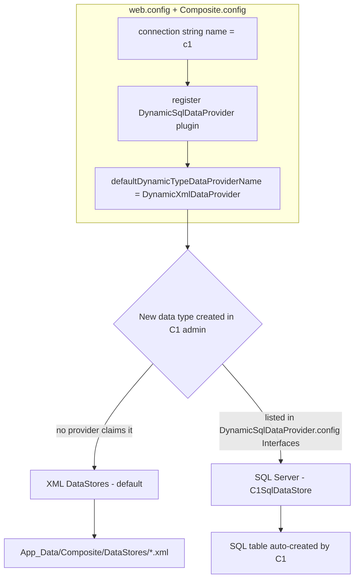

# C1 CMS Hybrid Data Store (XML + SQL Server) — Setup Guide & Context Memento

> **Purpose:** Configure a C1 CMS (Orckestra C1, 6.13) site so that most data types stay in the
> XML file store (keeping file-sync portability) while specific data types are stored in a
> Microsoft SQL Server database. This document is the authoritative reference — it corrects
> several incorrect claims commonly produced by AI assistants about this topic.

---

## 1. Executive Summary

- C1 CMS's SQL data provider **ships in the core** (`Composite.dll`) — **no package is required**
  for hybrid mode.
- The package `Composite.Tools.SqlServerDataProvider` only adds a **UI wizard** ("Convert to SQL")
  that performs a **destructive full migration** (renames the entire XML `DataStores` folder to
  `.bak`). It is **not needed** and should **not be run** if you want hybrid mode.
- Per-type routing between providers is done via **each provider's own config file**
  (`<ProviderName>.config` in `~/App_Data/Composite/Configuration/`), **not** via a
  `DataProviderMappings` node (which does not exist in this version).
- The routing knob for *new* dynamic types is `defaultDynamicTypeDataProviderName` in
  `Composite.config` (global default).

### Correct values vs. common AI mistakes

| Item | Correct value | Wrong value (AI-generated) |
|---|---|---|
| Connection string name | `c1` | `MySqlConnection`, `C1SqlProviderContext` |
| SQL provider plugin name | `DynamicSqlDataProvider` | `SqlDataProvider` |
| SQL provider type | `Composite.Plugins.Data.DataProviders.MSSqlServerDataProvider.SqlDataProvider, Composite` | `Composite.Data.Plugins.DataProvider.SqlDataProvider, Composite` |
| SQL config section name | `Composite.Data.Plugins.SqlDataProviderConfiguration` | `Composite.Plugins.Data.DataProviders.MSSqlServerDataProvider.InterfaceConfiguration` |
| Per-type routing node | provider `<Interfaces>` list in its own config | `<DataProviderMappings>` (does NOT exist) |
| Dynamic type assembly | generated dynamic assembly (`Cache/Assemblies`), **not** `App_Code` | `, App_Code` |

---

## 2. Architecture



Key concepts:

- **Default provider** decides where brand-new dynamic types go when no provider claims them.
- **Provider config file** (`~/App_Data/Composite/Configuration/<ProviderName>.config`) lists the
  interfaces a provider handles with their store details. This is what routes a *specific* type.
- **`Composite.Data.DataProviderCopier`** (core) copies types **and data** between providers,
  both directions, selectively (`Copy(Type[])`) or fully (`FullCopy()`).

---

## 3. Files That Matter

| Path | Role |
|---|---|
| `web.config` | holds `<connectionStrings>` entry named `c1` |
| `App_Data/Composite/Composite.config` | plugin registry; `defaultDynamicTypeDataProviderName`; `<DataProviderPlugins>` |
| `App_Data/Composite/Configuration/DynamicXmlDataProvider.config` | XML provider's `<Interfaces>` list (which types → XML, file/store mapping) |
| `App_Data/Composite/Configuration/DynamicSqlDataProvider.config` | SQL provider's `<Interfaces>` list (which types → SQL, table names) |
| `App_Data/Composite/DataMetaData/*.xml` | data type descriptors (schema: fields, key, typeManagerTypeName) |
| `App_Data/Composite/DataStores/*.xml` | XML data store files (empty `<Test />` = no records) |
| `App_Data/Composite/Cache/Assemblies/*.dll` | compiled dynamic-type assemblies; clear when type defs conflict |
| `App_Data/Composite/LogFiles/YYYYMMDD.txt` | C1 log; SQL provider writes DDL + init errors here |
| `bin/Composite.xml` | XML doc of `Composite.dll` — authoritative API reference |

---

## 4. Setup for a Fresh C1 CMS Installation (manual, no package)

### Step 1 — Create the SQL database

```sql
CREATE DATABASE C1SqlDataStore;
-- Important: keep AUTO_CLOSE OFF (a fresh DB may have AUTO_CLOSE ON, which causes SSMS Object
-- Explorer to report the DB as "inaccessible" when idle):
ALTER DATABASE C1SqlDataStore SET AUTO_CLOSE OFF;
```

### Step 2 — Add connection string to `web.config`

Place directly under `<configuration>`:

```xml
<connectionStrings>
  <add name="c1"
       connectionString="Data Source=SERVER;Initial Catalog=C1SqlDataStore;User ID=USER;Password=PASSWORD;Connect Timeout=30;Encrypt=False;TrustServerCertificate=False;ApplicationIntent=ReadWrite;MultiSubnetFailover=False;MultipleActiveResultSets=True"
       providerName="System.Data.SqlClient" />
</connectionStrings>
```

Notes:

- Connection string name **must be `c1`**.
- `MultipleActiveResultSets=True` is required (provider uses LINQ-to-SQL).
- Include `Initial Catalog` (the target database).

### Step 3 — Register the SQL provider in `Composite.config`

Inside `<Composite.Data.Plugins.DataProviderConfiguration>` → `<DataProviderPlugins>`, add
**immediately after** the `DynamicXmlDataProvider` entry:

```xml
<add connectionStringName="c1"
     sqlQueryLoggingEnabled="false"
     sqlQueryLoggingIncludeStack="false"
     type="Composite.Plugins.Data.DataProviders.MSSqlServerDataProvider.SqlDataProvider, Composite"
     name="DynamicSqlDataProvider" />
```

**Keep** `defaultDynamicTypeDataProviderName="DynamicXmlDataProvider"` so new types default to XML.

### Step 4 — Add a data type that lives in SQL

1. Temporarily change the attribute to
   `defaultDynamicTypeDataProviderName="DynamicSqlDataProvider"` in `Composite.config`.
2. Recycle the app (touch `Global.asax` or web.config change).
3. In C1 admin: **Data** perspective → **Add Data Type** → fill namespace/name/fields → Save & Publish.
4. C1 will: compile the interface, **auto-create** `DynamicSqlDataProvider.config`, and **auto-create
   the SQL table** in `C1SqlDataStore`.
5. Switch the default back to `DynamicXmlDataProvider` and recycle again.

> The existing SQL-bound type **keeps working** after the default is switched back to XML, because
> it is claimed by the `DynamicSqlDataProvider.config` `<Interfaces>` list.

### Step 5 — Add a data type that lives in XML

With the default at `DynamicXmlDataProvider`, simply create the type in C1 admin. It is stored in
`App_Data/Composite/DataStores/<Type>.xml` and appears in `DynamicXmlDataProvider.config`.

---

## 5. Routing Logic (how C1 picks a provider)

For any data type interface, C1 resolves the provider in this order (per
`Composite.Data.Foundation.DataProviderRegistry`):

1. **Explicit `[DataProvider("...")]` attribute** on the interface type (static types).
2. **Provider that claims the type** via its config file's `<Interfaces>` list
   (`IDataProvider.GetSupportedInterfaces()`).
3. **Fallback:** the `defaultDynamicTypeDataProviderName`.

This means a type listed in `DynamicSqlDataProvider.config` is routed to SQL **regardless of the
default**. Everything else falls through to the XML default.

### SQL provider config format (auto-generated, do not hand-craft unless mirroring exactly)

```xml
<?xml version="1.0" encoding="utf-8"?>
<configuration>
    <configSections>
        <section name="Composite.Data.Plugins.SqlDataProviderConfiguration"
                 type="Composite.Plugins.Data.DataProviders.MSSqlServerDataProvider.SqlDataProviderConfigurationSection, Composite, Version=6.13.9280.21599, Culture=neutral, PublicKeyToken=null" />
    </configSections>
    <Composite.Data.Plugins.SqlDataProviderConfiguration>
        <Interfaces>
            <add dataTypeId="GUID-OF-TYPE" isGeneratedType="true">
                <Stores>
                    <add tableName="SqlProvider_test" dataScope="public" cultureName="" />
                </Stores>
                <DataIdProperties>
                    <add name="Id" type="System.Guid, mscorlib, Version=4.0.0.0, Culture=neutral, PublicKeyToken=b77a5c561934e089" />
                </DataIdProperties>
            </add>
        </Interfaces>
    </Composite.Data.Plugins.SqlDataProviderConfiguration>
</configuration>
```

---

## 6. Data Type Definition Example

`App_Data/Composite/DataMetaData/test <dataTypeId>.xml`:

```xml
<DataTypeDescriptor dataTypeId="..." name="test" namespace="SqlProvider" title="test"
                    isCodeGenerated="true" cachable="false" searchable="false"
                    labelFieldName="NewField" typeManagerTypeName="SqlProvider.Test">
  <DataScopes><DataScopeIdentifier name="public" /></DataScopes>
  <KeyPropertyNames><KeyPropertyName name="Id" /></KeyPropertyNames>
  <Fields>
    <DataFieldDescriptor name="Id" instanceType="System.Guid, mscorlib" storeType="PhysicalStoreType='Guid'" />
    <DataFieldDescriptor name="NewField" isNullable="false"
                         instanceType="System.String, mscorlib"
                         storeType="PhysicalStoreType='String'Length='64'"
                         defaultValue="ValueType='String'Value=''" />
  </Fields>
</DataTypeDescriptor>
```

`typeManagerTypeName` is the generated interface full name (e.g., `SqlProvider.Test`).

---

## 7. Migrating Data Between Providers

Built-in class: **`Composite.Data.DataProviderCopier`** (in core `Composite.dll`).

- Constructor: `new DataProviderCopier(sourceProviderName, targetProviderName)`
  e.g., `("DynamicXmlDataProvider", "DynamicSqlDataProvider")` or reversed for SQL → XML.
- `Copy(IEnumerable<Type>)` — copies the given types **and their data records**.
- `FullCopy()` — copies everything (used by the package wizard; destructive to XML file layout).
- `IgnorePrimaryKeyViolation` — when `true`, skips already-copied records (safe re-runs).
- `UseTransaction` — wrap in a transaction.

To invoke without a browser UI, use a C1 **Inline C# Function** or a throwaway `.aspx` page calling
`DataProviderCopier`. The class is the same one the official wizard uses.

---

## 8. Troubleshooting (real issues encountered)

| Symptom | Root cause | Fix |
|---|---|---|
| "The data type interface 'X' did not validate... descriptors must have the same data type id" | stale compiled assembly / metadata for an earlier type with a different `dataTypeId` | delete the type's `DataMetaData/*.xml`, the `DynamicSqlDataProvider.config` entry, and clear `App_Data/Composite/Cache/Assemblies/*.dll`, then recycle |
| "No generated classes for data type 'test' found" | interface was never compiled because the create-type **workflow was aborted** (metadata saved, code not generated) | delete orphaned metadata + store files, clear cache, re-create the type in admin |
| SSMS: "The database ... is not accessible (ObjectExplorer)" | DB `AUTO_CLOSE` ON — DB shuts down when idle | `ALTER DATABASE C1SqlDataStore SET AUTO_CLOSE OFF`; reconnect in SSMS |
| All dynamic types disappear from Data perspective | type was removed from **both** provider configs (orphaned), or a provider config section was malformed | ensure each type appears in exactly one provider's `<Interfaces>`; fix section names |
| SQL table not created | table creation is **lazy** — only on first data access (`GetData`/`AddNew`) | open the type in C1 admin Data perspective / add a record |
| Dynamic type not found among loaded interfaces | the create workflow failed; interface never generated | re-create the type after clearing cache |
| config section silently ignored | section name / assembly-qualified handler type mismatch | use the auto-generated `Composite.Data.Plugins.SqlDataProviderConfiguration` + full `Version=...` type string |

### Config reloading
- After changing `web.config` / `Composite.config` / provider configs, recycle the app:
  - `(Get-Item <site>\Global.asax).LastWriteTime = Get-Date`
- Local IIS Express: run via `.vs/<site>/config/applicationhost.config`, e.g. site bound to
  `localhost:2681`.

---

## 9. Do's and Don'ts

**Do**
- Keep `defaultDynamicTypeDataProviderName="DynamicXmlDataProvider"` for file-sync portability.
- Add SQL-bound types by temporarily flipping the default, creating the type, then flipping back.
- Back up `App_Data/Composite/Configuration/DynamicXmlDataProvider.config` + `DataStores` before any
  manual config surgery (they are your rollback point).
- Clear `Cache/Assemblies` after changing data type metadata.

**Don't**
- Do NOT run the package wizard ("Convert to SQL") if you want hybrid — it migrates everything to
  SQL and renames your XML store to `.bak`.
- Do NOT use `<DataProviderMappings>` (does not exist in C1 6.13).
- Do NOT hand-craft the SQL config section name — let C1 auto-generate it, or copy the exact format
  shown above.

---

## 10. Quick Reference — Final Working Configuration (this project)

- Database: `C1SqlDataStore` on `izsmmmo-dc` (AUTO_CLOSE OFF)
- Connection string name: `c1`
- Providers: `DynamicXmlDataProvider` (default) + `DynamicSqlDataProvider`
- Default: `DynamicXmlDataProvider`
- SQL-bound type: `SqlProvider.Test` → table `dbo.SqlProvider_test2` (auto-created)
- Config files: `web.config`, `Composite.config`, `DynamicXmlDataProvider.config`,
  `DynamicSqlDataProvider.config`

---

## 11. Cross-Provider References (one type in XML, other in SQL)

**Answer: No problem.** C1 resolves references at the data-access layer, not the
storage layer. A reference from an XML-stored type to a SQL-stored type (or vice-versa)
works transparently in both directions.

### How it works

1. A reference — `Composite.Data.DataReference<T>` or a `[ForeignKey]` field — stores
   only the **key value** (GUID/string Id) of the referenced record as a plain column.
   The storage provider just stores that value; it does not care where the target is.
2. Resolution: `Composite.Data.DataReferenceFacade` → `DataFacade.GetData<T>()`.
3. `DataFacade` routes each type to its own provider independently (via provider config
   `<Interfaces>` claims). A lookup for a SQL-routed type hits the SQL provider;
   an XML-routed one hits XML.

### Why it works in hybrid mode

| Concern | Reality |
|---|---|
| Physical FK constraint | SQL provider (LINQ-to-SQL) does **not** create SQL Server FK constraints; integrity is logical, enforced by `DataReferenceFacade.TryValidateForeignKeyIntegrity` / `GetBrokenReferencesReport` at the app layer |
| Direction | XML→SQL and SQL→XML both work |
| Reverse reference (`GetReferees`) | Queries the referencing type's provider — works |
| Cascade delete | `AllowCascadeDeletes` handled by `DataReferenceFacade` at app layer — works |

### Watch-outs

1. **Migration must preserve Ids (critical).** References are key-based; migrated records
   must keep their Ids. `DataProviderCopier` with `IgnorePrimaryKeyViolation = true`
   copies records with existing keys → references stay valid.
2. **Dangling references possible.** C1 doesn't enforce FK at DB level; deleting a
   referenced record leaves the reference `null`/empty. Same within a single provider,
   not hybrid-specific. Detect via `DataReferenceFacade.GetBrokenReferencesReport()`.
3. **Performance (minor).** Cross-provider resolution = two lookups. For reference-heavy
   scenarios, keep related types on the same provider.
