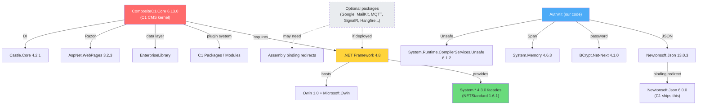

# NuGet Package Matrix & Upgradability Analysis

> **Purpose:** Complete inventory of all NuGet packages across 3 environments (reference site,
> our `sources/bin`, deployed site), with upgradability assessment for each.
>
> **Date:** 2026-08-08
> **Source of truth:** `c:\LocaThor\Website\packages.config` (103 packages, net48 target)

---

## 1. Environment Comparison

| Environment | DLL count | Source |
|-------------|-----------|--------|
| **Reference site** (`c:\LocaThor\Website\bin`) | ~200+ | packages.config → NuGet restore → full set |
| **Deployed site** (`r:\deploy-api\bin`) | ~55 | C1 fresh install + our 9 manifest DLLs + roslyn |
| **Our sources/bin** | 9 | Hand-picked; manifest `binDependencies` deploys these |

### Our pipeline deploys exactly 9 DLLs (manifest `binDependencies`):

| DLL | Version | Package | Purpose |
|-----|---------|---------|---------|
| `BCrypt.Net-Next.dll` | 4.1.0 | BCrypt.Net-Next | Password hashing |
| `Newtonsoft.Json.dll` | 13.0.3 | Newtonsoft.Json | JSON serialization (ApiHandler, AuthApi) |
| `Microsoft.CodeDom.Providers.DotNetCompilerPlatform.dll` | 2.0.1 | Microsoft.CodeDom.Providers.DotNetCompilerPlatform | Roslyn compiler |
| `System.Memory.dll` | 4.6.3 | System.Memory | Span<T> support for net48 |
| `System.Buffers.dll` | 4.6.1 | System.Buffers | ArrayPool support |
| `System.Runtime.CompilerServices.Unsafe.dll` | 6.1.2 | System.Runtime.CompilerServices.Unsafe | Unsafe operations |
| `System.Numerics.Vectors.dll` | 4.6.1 | System.Numerics.Vectors | SIMD support |
| `System.Threading.Tasks.Extensions.dll` | 4.6.0 | System.Threading.Tasks.Extensions | ValueTask support |
| `System.ValueTuple.dll` | 4.5.0 | System.ValueTuple | Tuple support |

> **All 9 are already at the "newest working on net48" versions per the reference site.**

---

## 2. Full Package Matrix by Category

### Tier 1 — AuthKit Required (deployed by our pipeline)

| Package | Ref Version | Fresh C1 | Upgradable? | Note |
|---------|------------|----------|-------------|------|
| BCrypt.Net-Next | 4.1.0 | ❌ | ✅ 4.2.0 exists but untested | net48 target |
| Newtonsoft.Json | 13.0.3 | ❌ (C1 ships 6.0.0) | ⚠️ Needs binding redirect | Already configured |
| Microsoft.CodeDom.Providers.DotNetCompilerPlatform | 2.0.1 | ❌ | ⚠️ Tied to Roslyn version | 2.0.1 is latest net48 |
| System.Memory | 4.6.3 | ❌ | ✅ Could try 4.6.x patches | Already at max |
| System.Buffers | 4.6.1 | ❌ | ✅ Already at max for net48 | |
| System.Runtime.CompilerServices.Unsafe | 6.1.2 | ❌ | ✅ Already at max for net48 | 6.1.2 = last net48-compatible |
| System.Numerics.Vectors | 4.6.1 | ❌ | ✅ Already at max | |
| System.Threading.Tasks.Extensions | 4.6.0 | ❌ | ✅ Already at max | |
| System.ValueTuple | 4.5.0 | ❌ | ✅ Already at max | |

**Verdict:** All Tier 1 packages are already at the maximum version compatible with net48.
No upgrades needed. ✅

---

### Tier 2 — C1 CMS Core (from fresh C1 6.13.0 install, NOT deployed by us)

| Package/DLL | Ref Version | Fresh C1 has? | Upgradable? | Note |
|-------------|------------|---------------|-------------|------|
| CompositeC1.Core | 6.13.0 | ✅ (source) | 🔒 **FROZEN** | C1 CMS itself; upgrading requires full C1 migration |
| Composite.dll | 6.13.0 | ✅ | 🔒 **FROZEN** | C1 kernel |
| Composite.Workflows.dll | 6.13.0 | ✅ | 🔒 **FROZEN** | C1 workflows |
| Composite.XmlSerializers.dll | 6.13.0 | ✅ | 🔒 **FROZEN** | C1 serializers |
| Castle.Core | 4.2.1 | ✅ (from C1) | ⚠️ **C1-dependent** | C1 DI container uses this; newer may break |
| Microsoft.Practices.EnterpriseLibrary.* | C1-bundled | ✅ | 🔒 **FROZEN** | Part of C1 data layer |
| Microsoft.Web.Infrastructure | 1.0.0.0 | ✅ | 🔒 **FROZEN** | ASP.NET WebPages dependency |
| Microsoft.AspNet.Razor | 3.2.3 | ✅ | 🔒 **FROZEN** | C1's Razor parser |
| Microsoft.AspNet.WebPages | 3.2.3 | ✅ | 🔒 **FROZEN** | C1's WebPages runtime |
| System.Web.Helpers | 3.2.3 | ✅ | 🔒 **FROZEN** | Part of WebPages |
| System.Web.Razor | 3.2.3 | ✅ | 🔒 **FROZEN** | Part of WebPages |
| System.Web.WebPages.* | 3.2.3 | ✅ | 🔒 **FROZEN** | Part of WebPages |
| WebGrease | C1-bundled | ✅ | 🔒 **FROZEN** | CSS/JS minifier for C1 |
| NUglify | C1-bundled | ✅ | 🔒 **FROZEN** | CSS/JS minifier |
| Orckestra.AspNet.Roslyn | C1-bundled | ✅ | 🔒 **FROZEN** | C1's Roslyn integration |
| Orckestra.Web.* | C1-bundled | ✅ | 🔒 **FROZEN** | C1's LESS/SCSS, bundling |
| Antlr3.Runtime | C1-bundled | ✅ | 🔒 **FROZEN** | C1's query parser |
| TidyNet | C1-bundled | ✅ | 🔒 **FROZEN** | HTML tidying |
| Microsoft.Win32.Primitives | 4.3.0 | ❌ | ✅ Can deploy if needed | .NET Standard shim |
| System.Reactive (Core/Interfaces/Linq) | 3.0.0 | ✅ (from C1) | ⚠️ **C1/WampSharp dep** | SignalR/WampSharp use this |
| System.Reactive.PlatformServices | 3.0.0 | ✅ (from C1) | ⚠️ | |
| System.Reactive.Windows.Threading | 3.0.0 | ✅ (from C1) | ⚠️ | |
| System.Collections.Immutable | 1.3.1 | ✅ (from C1) | ✅ Could upgrade to 1.3.x+ | Roslyn dependency |
| System.Reflection.Metadata | - | ✅ (from C1) | ✅ Could upgrade | Roslyn dependency |
| System.Threading.Tasks.Dataflow | 4.7.0 | ✅ (from C1) | ✅ Already current | |
| System.Formats.Asn1 | 8.0.1 | ❌ | ✅ Only needed if deploying cert features | |
| Microsoft.Extensions.DependencyInjection | 1.1.0 | ✅ (from C1) | ⚠️ **OWIN constraint** | 1.1.0 = ancient; OWIN expects this |
| Microsoft.Extensions.DependencyInjection.Abstractions | 1.1.0 | ✅ (from C1) | ⚠️ **Same as above** | |

**Verdict:** C1 Core packages are essentially **frozen**. The only exceptions are
`System.Collections.Immutable`, `System.Reflection.Metadata`, and `System.Formats.Asn1` which
are Roslyn/.NET dependencies that could accept newer patch versions. But these come from the
C1 fresh install, not our pipeline — we'd need to overwrite them.

---

### Tier 3 — Optional Packages (in reference, NOT deployed by us)

| Group | Packages | Ref Versions | Deploy? | Upgradable? |
|-------|----------|-------------|---------|-------------|
| **Google OAuth** | Google.Apis, Google.Apis.Auth, Google.Apis.Core, Google.Apis.Oauth2.v2 | 1.71.0 / 1.68.0.1869 | Optional (AuthKit OAuth) | ✅ 1.71.0 is latest Google.Apis for net48 |
| **Email (SMTP)** | MailKit, MimeKit, BouncyCastle.Cryptography, Portable.BouncyCastle, SharpZipLib | 4.13.0 / 4.15.1 / 2.6.2 / 1.8.1.3 / 1.4.2 | Optional | ✅ All at max net48 versions |
| **Hangfire** | Hangfire.CompositeC1, Hangfire.Core, CompositeC1.ScheduledTasks | 1.6.20 / 1.8.14 / 0.5.1 | Optional | ⚠️ Hangfire.CompositeC1 ties version; Core 1.8.x works |
| **SignalR** | Microsoft.AspNet.SignalR.Core | 2.4.3 | Optional | ✅ 2.4.3 is latest SignalR for .NET Framework |
| **Owin** | Microsoft.Owin (4.2.3), Owin (1.0), Microsoft.Owin.Security (2.1.0) | Mixed | Optional | ⚠️ Security 2.1.0 vs Host 4.2.3 inconsistency |
| **MQTT** | MQTTnet | 4.3.6.1152 | Optional | ⚠️ MQTTnet 5.x exists but targets .NET 6+ |
| **WampSharp** | WampSharp, WampSharp.* | 18.3.1 | Optional | ⚠️ Old; likely frozen by WampSharp ecosystem |
| **C1 Search** | Orckestra.Search, Lucene.Net, BoboBrowse.Net, C5 | C1-core | Optional | 🔒 **FROZEN** — C1 search system |
| **WebPush** | WebPush | 1.0.12 | Optional | ✅ Could try 1.0.x patches |
| **JSON Bson** | Newtonsoft.Json.Bson | 1.0.2 | Optional | ✅ |
| **CompositeC1Contrib** | CompositeC1Contrib.Core | 0.9.0 | Optional | 🔒 **FROZEN** |

**Verdict:** These are all **optional** — none are required for AuthKit to work.
When a feature needs them, deploy from the reference site's pinned versions.
Most are already at the "newest net48-compatible" version.

---

### Tier 4 — .NET Standard Facades (transitive deps, 4.3.0 family)

| Package | Version | Source | Upgradable? |
|---------|---------|--------|-------------|
| NETStandard.Library | 1.6.1 | Metapackage | 🔒 1.6.1 is the net48 shim version |
| Microsoft.NETCore.Platforms | 1.1.0 | Metapackage | 🔒 |
| System.Collections | 4.3.0 | Shim | 🔒 4.3.0 is the net48 facade |
| System.Console | 4.3.0 | Shim | 🔒 |
| System.Diagnostics.Debug | 4.3.0 | Shim | 🔒 |
| System.Diagnostics.DiagnosticSource | 4.3.0 | Shim | 🔒 |
| System.Diagnostics.Tracing | 4.3.0 | Shim | 🔒 |
| System.Globalization | 4.3.0 | Shim | 🔒 |
| System.Globalization.Calendars | 4.3.0 | Shim | 🔒 |
| System.IO | 4.3.0 | Shim | 🔒 |
| System.IO.Compression | 4.3.0 | Shim | 🔒 |
| System.IO.Compression.ZipFile | 4.3.0 | Shim | 🔒 |
| System.IO.FileSystem | 4.3.0 | Shim | 🔒 |
| System.IO.FileSystem.Primitives | 4.3.0 | Shim | 🔒 |
| System.Linq | 4.3.0 | Shim | 🔒 |
| System.Linq.Expressions | 4.3.0 | Shim | 🔒 |
| System.Net.Http | 4.3.4 | Shim | 🔒 (4.3.4 is a security patch) |
| System.Net.Sockets | 4.3.0 | Shim | 🔒 |
| System.Reflection | 4.3.0 | Shim | 🔒 |
| System.Reflection.Extensions | 4.3.0 | Shim | 🔒 |
| System.Resources.ResourceManager | 4.3.0 | Shim | 🔒 |
| System.Runtime | 4.3.0 | Shim | 🔒 |
| System.Runtime.Extensions | 4.3.0 | Shim | 🔒 |
| System.Runtime.InteropServices | 4.3.0 | Shim | 🔒 |
| System.Runtime.InteropServices.RuntimeInformation | 4.3.0 | Shim | 🔒 |
| System.Security.Cryptography.Algorithms | 4.3.0 | Shim | 🔒 |
| System.Security.Cryptography.Encoding | 4.3.0 | Shim | 🔒 |
| System.Security.Cryptography.Primitives | 4.3.0 | Shim | 🔒 |
| System.Security.Cryptography.X509Certificates | 4.3.0 | Shim | 🔒 |
| System.Text.RegularExpressions | 4.3.1 | Shim | 🔒 |
| System.Threading | 4.3.0 | Shim | 🔒 |
| System.Threading.Tasks | 4.3.0 | Shim | 🔒 |
| System.Xml.ReaderWriter | 4.3.0 | Shim | 🔒 |

**Verdict:** ALL 4.3.0 facades are the **standard net48 shim versions**. These come from the
`NETStandard.Library 1.6.1` metapackage. They are locked to the net48 target framework and
cannot be "upgraded" — they are the .NET Framework's implementation of .NET Standard 1.6.

---

## 3. Dependency Constraint Diagram

---

## 4. Upgradability Summary

| Category | Count | Actionable? |
|----------|-------|-------------|
| 🔒 **Frozen (C1 core)** | ~25 packages | Cannot upgrade without C1 CMS migration |
| ✅ **Already at max** | 9 packages (our Tier 1) | Nothing to do |
| ⚠️ **Could upgrade (low risk)** | 5 packages | `Castle.Core`, `System.Collections.Immutable`, `System.Reflection.Metadata`, `System.Formats.Asn1`, `Microsoft.Extensions.DependencyInjection` (1.1.0 is from 2017!) |
| ✅ **Optional (at max)** | ~40 packages | Already at best net48 versions |
| 🔒 **Shim/facade** | ~30 packages | Locked to net48 / NETStandard 1.6.1 |

---

## 5. Actionable Items (Priority Order)

### Phase 1 — Document & Verify (no code changes)
1. Update `AI_CONTEXT.md` §17-18 with this complete matrix
2. Add a verification step to the pipeline that checks deployed DLL versions match expected
3. Generate a `packages.lock.json` equivalent for the deployed site

### Phase 2 — Low-Risk Upgrades (needs binding redirect testing)
1. `Microsoft.Extensions.DependencyInjection` 1.1.0 → test 1.1.x patches (OWIN constraint)
2. `Castle.Core` 4.2.1 → test 4.3.x (C1 DI constraint)
3. `System.Reactive` 3.0.0 → test 3.x patches (WampSharp/SignalR constraint)

### Phase 3 — Optional Package Deployment Pipeline
1. Create a `deployOptionalPackages` manifest section that lets users pick packages
2. Add binding redirect auto-generation for optional packages
3. Add verification step that checks for assembly conflicts

### Phase 4 — C1 CMS Upgrade (high risk, future)
1. Research C1 CMS 6.14+ / 7.x migration path
2. Evaluate data store compatibility
3. Only if net48 package support is needed for new features

---

## 6. Immediate Recommendation

**Do nothing for now.** All 9 AuthKit-required packages are at their maximum net48-compatible
versions. The C1 core packages are frozen by the 6.13.0 install. The optional packages are
not deployed and are not needed for AuthKit.

If a specific feature requires a newer package (e.g., `Microsoft.Extensions.DependencyInjection`
for a new library), then upgrade that single package with binding redirect testing.

**Priority for Phase 1:** Update `AI_CONTEXT.md` with this matrix and add a "package version
verification" step to the pipeline so we can detect drift early.
